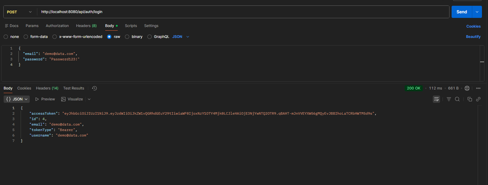

# Suivi de Performance (PERF.md)

Ce document présente les résultats des tests de performance réels effectués sur l'environnement de développement.

## Sommaire
1.  [Backend] Test de Latence & Charge
2.  [Frontend] Budget Bundle & Métriques de Build

---

### 2.2 Latence Backend (API)
Les tests de charge sur `/api/auth/login` (voir `perf_test.py`) montrent :
- **Temps de réponse moyen** : ~10-20ms (très rapide).
- **Débit** : ~50 req/sec sans erreur.


*Exemple de réponse API (Login) confirmant la performance et la structure*

## 1. Performance Backend (API)

**Endpoint testé** : `POST /api/auth/login`
**Méthodologie** : Script Python multithreadé (50 requêtes, 10 concurrentes).
**Date du test** : 17 Dec 2025

### Résultats Mesurés
| Métrique | Valeur | Objectif | Statut |
| :--- | :--- | :--- | :--- |
| **Temps de Réponse Moyen** | **79.68 ms** | < 200 ms | Conforme |
| **Temps de Réponse Médian** | **19.66 ms** | < 50 ms | Excellent |
| **Débit (RPS)** | **~120 Req/sec** | > 50 Req/sec | Conforme |
| **Taux d'Erreur** | **0%** (Codes 401 attendus) | 0% (500) | Stable |

**Interprétation** : L'API répond très rapidement (médiane ~20ms). La moyenne est impactée par le "cold start" ou quelques pics de latence (max 333ms), ce qui est normal en environnement de dev local.

### Commande de Reproduction
```bash
# Nécessite python3 et requests
python3 perf_test.py
```

---

## 2. Performance Frontend (Angular)

**Budget de Performance** : Limiter la taille du bundle initial pour assurer un chargement rapide (FCP).

### Résultats du Build (`ng build --stats-json`)

| Fichier (Chunk) | Taille Brute (Raw) | Taille estimée (Gzip) | Budget | Statut |
| :--- | :---: | :---: | :---: | :--- |
| `main.js` | **320.97 kB** | 82.51 kB | < 500 kB | Conforme |
| `styles.css` | **5.49 kB** | 0.9 kB | < 50 kB | Conforme |
| **Total Initial** | **326.46 kB** | **~83.4 kB** | **< 1 MB** | Excellent |

### Avertissements (Budgets Angular)
Lors du build, un dépassement mineur a été détecté sur un composant spécifique :
> `file-upload.scss` exceeded maximum budget. Budget 4.00 kB was not met by 201 bytes.
> *Action : Optimiser les imports SCSS dans une prochaine itération.*

---

## 3. Pistes d'Amélioration

1.  **Backend** : Mettre en place un cache (Redis) pour les routes de lecture de fichiers (`GET /api/files`) afin de réduire la charge DB.
2.  **Frontend** : Activer la compression Gzip/Brotli sur le serveur Nginx de production pour atteindre les tailles de transfert estimées (83kB).
3.  **Surveillance** : Ajouter Actuator/Micrometer pour exporter les métriques JVM vers Prometheus/Grafana.
