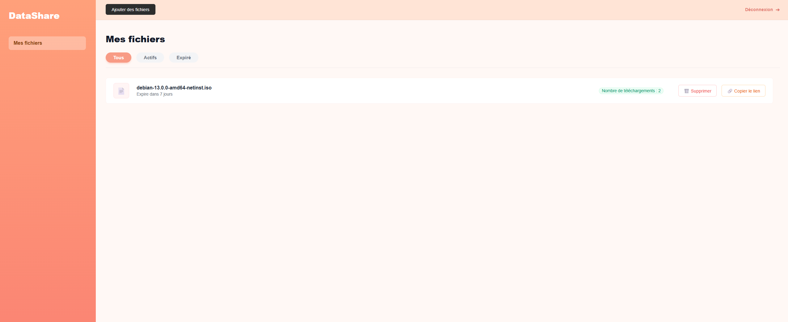
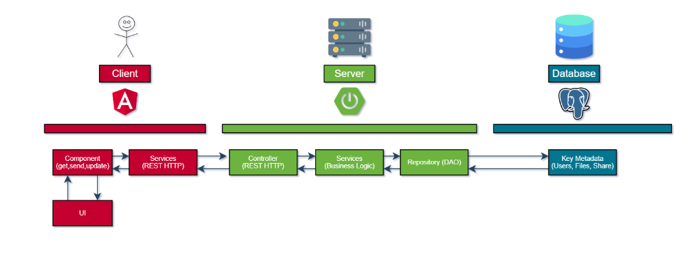
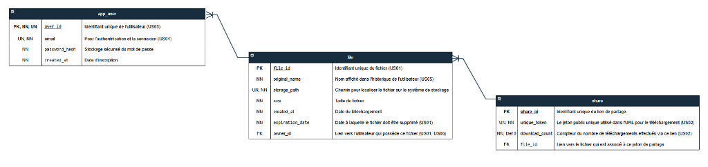
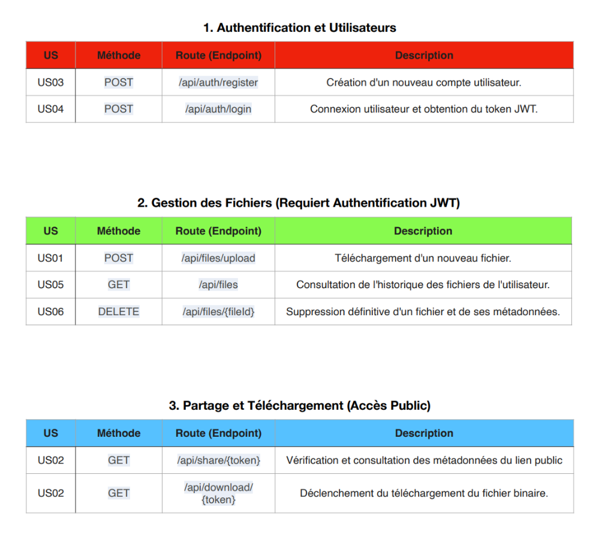

# DataShare

DataShare est une application web sécurisée de partage de fichiers, développée dans le cadre du projet "Pilotez une solution informatique" (OC DevOps). Elle permet aux utilisateurs de s'inscrire, de stocker des fichiers personnels et de les partager via des liens uniques.

---

## [Documentation des User Stories](US.md)


*Tableau de bord de l'application DataShare*

## Fonctionnalités Principales des documents techniques requis pour la maintenance et la compréhension du projet :

*   **[Choix Techniques](./CHOIX_TECHNIQUES.md)** : Justification de la stack (Java/Angular), BDD et outils.
*   **[Sécurité](./SECURITY.md)** : Rapport d'audit OWASP, implémentation JWT et bonnes pratiques.
*   **[Stratégie de Tests](./TESTING.md)** : Détails des tests Unitaires, Intégration et E2E (Couverture, Outils).
*   **[User Stories](./US.md)** : Liste des fonctionnalités et matrice de traçabilité (Tests/Code).
*   **[Maintenance](./MAINTENANCE.md)** : Procédures de surveillance, backup et gestion des logs.
*   **[Performance](./PERF.md)** : Audit de performance et plan de montée en charge.
*   **[Commandes](./COMMANDES.md)** : Commandes utiles et mémo technique.
*   **[Maquettes Figma](https://www.figma.com/design/XEinfkoE7mXktCCfMs3E8c/DataShare?node-id=0-1&p=f&t=7FcjTcbcCYzlWxON-0)** : Design System et maquettes UI de l'application.

---

## Architecture Technique

### Vue Globale


Le projet est structuré en deux parties distinctes :

### Backend (`/back-ocdevops03-pilotez-solution-informatique`)
*   **Langage** : Java 21
*   **Framework** : Spring Boot 4
*   **Base de données** : PostgreSQL
*   **Sécurité** : Spring Security + JWT
*   **Documentation API** : Code entièrement commenté (Javadoc)

### Frontend (`/front-ocdevops03-pilotez-solution-informatique`)
*   **Langage** : TypeScript
*   **Framework** : Angular 21 (Standalone Components)
*   **Design** : SCSS modulaire
*   **Tests** : Jest (Unitaires) & Cypress (E2E)

### Modèle de Données


### Endpoints Principaux


---

## Installation et Démarrage

### Prérequis
*   Java 21 JDK
*   Node.js (v20+)
*   PostgreSQL (Local ou Docker)

### 1. Base de Données
Créez une base de données PostgreSQL nommée `datashare` (ou mettez à jour `application.yaml`).

```bash
# Exemple avec Docker
docker run --name datashare-db -e POSTGRES_PASSWORD=root -e POSTGRES_DB=datashare -p 5432:5432 -d postgres
```

### 2. Démarrer le Backend
```bash
cd back-ocdevops03-pilotez-solution-informatique
# Configuration des variables d'environnement (optionnel, valeurs par défaut dans application.yaml)
export DB_USERNAME=postgres
export DB_PASSWORD=root
# Lancer l'application
./mvnw spring-boot:run
```
L'API sera accessible sur `http://localhost:8080`.

### 3. Démarrer le Frontend
```bash
cd front-ocdevops03-pilotez-solution-informatique
npm install
npm start
```
L'application sera accessible sur `http://localhost:4200`.

---

## Fonctionnalités
*   **Authentification** : Inscription et Connexion sécurisée.
*   **Gestion de fichiers** : Upload, Liste, Téléchargement, Suppression.
*   **Partage** : Génération de lien public pour partage externe.
*   **Sécurité** : Contrôle d'accès basé sur les rôles (RBAC) et validation des extensions de fichiers.
