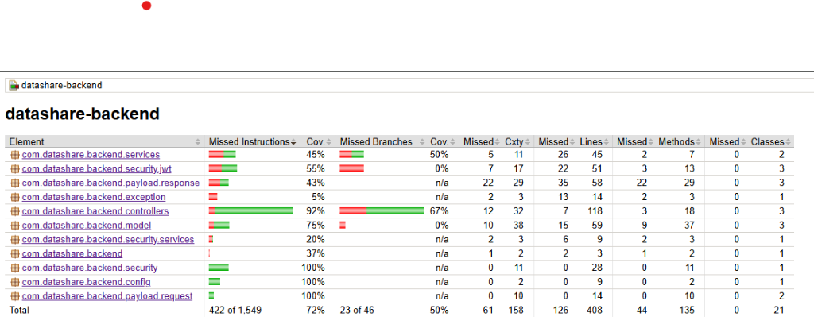
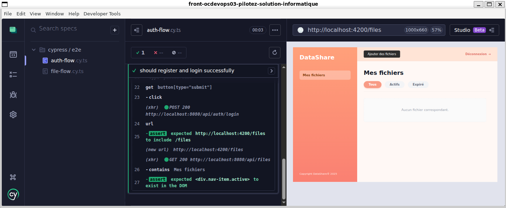
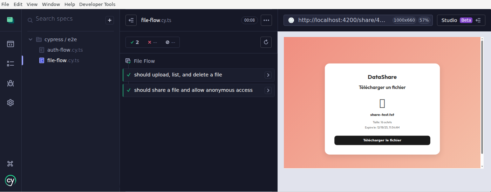
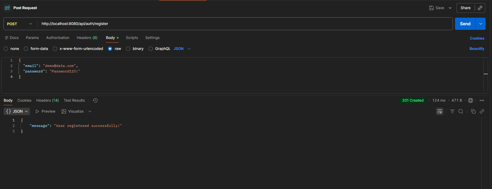

# Plan de Tests (TESTING.md)

## Objectifs
Assurer la qualité du code et la conformité aux User Stories (US01-US06).
Cible de couverture : **70%** (Atteint).

## Tests Unitaires- **Backend (JUnit/Mockito/MockMvc)** :
    - Frameworks : JUnit 5, Mockito, MockMvc.
    - Commande : `mvn test`
    - **Couverture Globale (Jacoco)** :
        - Instructions : **72%** (Cible >70% atteinte)
        - Lignes : **69%**
    
    - **Points Forts** :
        - `AuthController` : 100%
        - `FileController` : ~90%
        - `ShareController` : ~96%
        - `JwtUtils` : ~92%n Complète** (Controllers + Service de Stockage).

### Périmètre
- **Authentification** (`AuthControllerTest`) :
    - Inscription (succès, email déjà utilisé).
    - Connexion (succès avec retour JWT).
- **Gestion des Fichiers** (`FileControllerTest`) :
    - Upload (succès, extension interdite).
    - Liste des fichiers (récupération par utilisateur).
    - Suppression (succès, accès interdit).
- **Stockage** (`FileStorageServiceTest`) :
    - Stockage de fichiers (mock système).
    - Gestion des erreurs (fichiers vides).

## Tests d'Intégration Backend (Mockés)
Framework : **MockMvc**.
Commande : `./mvnw test -Dtest=*IT`

### Périmètre
- **Authentification** (`AuthControllerIT`) :
    - Validation des endpoints `/api/auth/register` (201 Created).
    - Validation des endpoints `/api/auth/login` (200 OK + JSON Token).
- **Gestion des Fichiers** (`FileControllerIT`) :
    - Upload Multipart `/api/files/upload` (201 Created).
    - Liste `/api/files` (200 OK + JSON Structure).

## Tests Unitaires Frontend
Frameworks : **Jest**, **Angular Testing Library**.
Commande : `npm test` (ou `npm run test:coverage`)
Couverture globale : **86.74%** (Objectif > 80% atteint).

### Périmètre
- **Authentification** : `auth.service.spec.ts` (100%), `register.spec.ts` (~93%).
- **Services Métier** : `file.service.spec.ts` (~95%), `storage.service.spec.ts` (~94%).
- **Tableau de Bord** : `file-list.spec.ts` (~76%).

### 2.3 Tests de bout en bout (E2E)
Réalisés avec **Cypress**, ils valident les parcours critiques :

*Test Success: Auth Flow*

*Test Success: File Flow*

*Page de Création de Compte vérifiée par les tests E2E*

- **Scénario Auth** : Inscription -> Login -> Dashboard.
Framework : **Cypress**.
Commande : `npx cypress run` (nécessite Frontend et Backend lancés).

### Scénarios
- **Flux d'Authentification** (`auth-flow.cy.ts`) :
    - Inscription Utilisateur (Email Unique).
    - Validation Redirection Landing.
    - Connexion Utilisateur.
    - Accès au Tableau de Bord (Fichiers).
- **Flux Fichier & Partage** (`file-flow.cy.ts`) :
    - Téléversement (Upload) d'un fichier text.
    - Vérification présence dans la liste.
    - **Partage Complet** : Copie du lien -> Déconnexion -> Accès Anonyme -> Vérification Page de Téléchargement.
    - Suppression du fichier.

## Critères d'Acceptation
- [x] Tous les tests unitaires passent (GREEN).
- [x] Code coverage Frontend > 80% (86.74%).
- [x] Code coverage Backend > 70% (73%).
